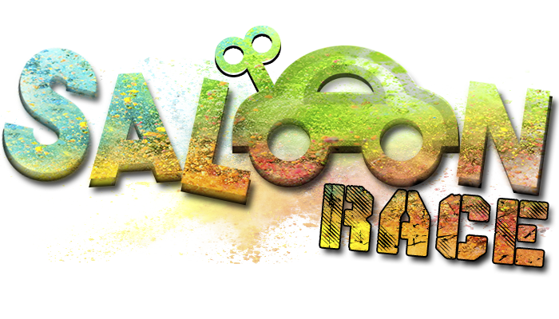

[Ir al juego](https://www.jaimefrias.es/saloon-race)

Práctica de la asignatura *Sistemas Gráficos* de la ETSIIT, curso 2017-2018. Consiste en un juego desarrollado con Javascript con la ayuda de la librería de gráficos **THREE.js**, en el que el objetivo es esquivar obstáculos que se presentan en un largo pasillo aumentándose la dificultad conforme se pasa de nivel.

## Características
 * Diferentes cinemáticas durante el desarrollo del juego. :movie_camera:
 * Habitaciones sin luces donde se alternaran las luces del mismo coche. :bulb:
 * Aceleración en cada nivel. :car:
 * Powerups para aumentar la vida. :heart:
 * Powerups para ralentizar el tiempo. :watch:
 * 8 niveles con dificultad incremental. :warning:
 * Sonidos al colisionar y en transiciones de menu. :collision:
 * Musica de fondo propia/cover. :musical_note:
 * Texturas cambian en función del nivel. :flower_playing_cards:
 * Sistema de vida que se reinicia al subir de nivel y baja al colisionar. :moyai:
 * Tienda donde comprar powerups extra con los puntos acumulados al jugar. :dollar:

 
 

## Imágenes :camera:

## Controles
Se usa el **cursor** del ratón para mover al coche dentro de los límites establecidos, y para pausar el juego se usa la tecla espacio.

## Estructura de datos
